# GoAI A2A Runtime

## 定位

GoAI 是多 Agent 协议运行时平台。Agent 之间的业务通信统一使用 A2A；Workflow/Eino Graph 负责描述某个 Agent 如何执行能力，不能替代 Agent 间协议通信。

```mermaid
graph LR
    U[AG-UI Client] --> G[AG-UI Gateway]
    G --> P[Thread / Message / Parent Run]
    P --> W[Coordinator Eino Graph]
    W --> N[agent node]
    N --> C[AgentAsTool / A2A Client]
    C -->|loopback HTTP or remote HTTPS| T[Target A2A Gateway]
    T --> D[Delegation / Child Run]
    D --> E[Target Eino Graph / Tool / LLM]
    E --> CB[Authenticated A2A callback]
    CB --> Q[Kafka run_resume]
    Q --> R[Resume from persisted cursor]
    R --> S[RunStep / Message persistence]
    S --> UI[AG-UI SSE]
```



## 通信边界

- 本地 Agent：使用 loopback HTTP 访问目标 Agent 的 A2A Gateway。
- 远程 Agent：必须使用 HTTPS；远程 HTTP 地址被出站客户端拒绝。
- Kafka：只负责 `run_execute`、`run_resume` 和恢复调度的 Worker 异步边界，不表达 Agent 委派语义。
- 禁止 `RunService -> TargetAgentService` 进程内直调。
- 禁止只投递一个 `run_id` 的 Kafka 消息来冒充 A2A。

本地和远程使用同一套 A2A HTTP+JSON 请求、Task 状态和结果 Artifact 契约，区别只在传输安全边界。

## Registry 发布门禁

Agent Registry 是 A2A Runtime 的管理面前置条件，不是新的执行 transport。

- 所有可委派 Agent 必须先注册，Workflow 的 `agent` / `agent_tool` / `agent_group` 节点只能引用 Registry 中的 Agent 与 Capability，不接受任意 URL
- Agent 默认 inactive；V1 至少需要一个由当前 Agent 的 active Workflow 支撑、版本一致的 active Capability，以及通过 Agent Card 身份校验的 active Endpoint 和完整凭据配置，才能发布
- `tool/custom` Capability 在 V1 仅作为管理资产，不能单独满足发布门禁，也不会进入 Agent Card；Agent Card 的 Delegation extension 必须声明与 Registry 相同的 `agentCode`，防止 Endpoint 地址指向错误 Agent
- Endpoint 变更后健康状态重置，必须重新 discovery；健康失败会标记 unhealthy，最后一个健康 Endpoint 失效时 Agent 自动停用；`config_json` 仅允许非敏感元数据，认证材料必须使用 `credential_ref`
- Registry API 只改变管理资产和发布状态，跨 Agent 任务仍只通过 A2A HTTP(S) 发生

## 出站调用流程

1. Supervisor `RunService` 执行 Workflow 的 `agent`、`agent_tool` 或 `agent_group` 节点。
2. `routing_policy=registry` 时，Registry Router 按 `agent_code` 稳定顺序，从 active Agent、版本一致的 Workflow Capability 和 active A2A Endpoint 中选择 Worker；显式 `target_agent` 也经过同一套 Registry 门禁。
3. Runtime 根据选中的 `Agent`、`AgentCapability` 和 `AgentEndpoint` 组装 `AgentInvocationRequest`，并把选路原因和 Workflow 版本写入 RunStep 输出。
4. `a2aclient` 通过 Agent Card discovery 获取目标能力声明，并校验 HTTP+JSON binding、Capability、Delegation extension 和 Push Notification 能力。
5. Client 使用官方 A2A Go SDK 发送带 PushConfig 的 `message:send`，并设置 `ReturnImmediately=true`。
6. 目标 Gateway 将请求映射为 `Message + Delegation + Child Run`，持久化 PushConfig，投递 Child Run，并立即返回 accepted Task。
7. 源 Runtime 将当前 Parent Run 和 RunStep 原子推进为 `waiting_external`，保存 Parent Step 与后继节点游标，随后释放 Worker。
8. Target Child Run 独立执行；进入成功、失败或取消终态后，将 Task/Artifact 作为签名 callback 发往源 Gateway。
9. 源 Runtime 校验机器身份、notification token、Task/Delegation 关联和终态事件哈希，幂等写入 Result Message。
10. 成功 callback 发布 Kafka `run_resume`；Resume Worker 原子 claim Delegation 与 Parent Run，从持久化后继节点游标继续 Eino Graph。
11. Parent Run 终态和 Result Message 继续由 AG-UI SSE 从数据库快照回传；客户端断开不会取消已经落库的跨 Agent 协作。

## Task cancel

来源 Agent 可以对自己发起的 Task 调用官方 A2A `CancelTask`：

1. A2A Gateway 校验机器身份，并把 `task_id`、来源 Agent 和目标 Agent 交给 Runtime。
2. Runtime 在事务中锁定 Delegation 和 Child Run，校验来源/目标归属。
3. `pending/queued/running/waiting_external` Child Run 进入 `cancelled`，活动 RunStep 进入 `skipped`；终态重复取消直接返回当前快照。
4. 目标 Runtime 取消进程内执行上下文，禁止后续 Workflow 节点继续创建。
5. 事务提交后复用已有 Delegation reconciliation 和认证 callback，把取消终态回送源 Agent；源 Runtime 按既有 callback 规则终结 Parent Run 或 group。

取消仍然通过 A2A HTTP(S) 发生。Kafka 只承载目标 Run 的内部执行/恢复消息，不能替代取消请求。

## 委派关联元数据

GoAI 在 Delegation 扩展中同时传递协议路由信息和运行时关联信息：

```json
{
  "https://goai.dev/extensions/delegation/v1": {
    "sourceAgentCode": "planner",
    "capabilityCode": "write",
    "parentRunId": "run-parent",
    "traceId": "trace-parent",
    "delegationId": "a2a_delegation_id"
  }
}
```

- `parentRunId` 关联源 Agent 的 Parent Run。
- `delegationId` 是基于 Parent Run 与 Workflow 节点生成的稳定委派标识，重试不会变化。
- `traceId` 贯通出站 A2A 请求、目标 Agent Child Run、Delegation、RunStep 和日志。
- 目标 Gateway 将扩展映射为内部 `AcceptDelegationCommand`，再落库为 `Message + Delegation + Child Run`；外部协议字段不会渗透到执行器。

## Workflow agent 节点

```json
{
  "key": "delegate_writer",
  "type": "agent",
  "config": {
    "capability": "write",
    "routing_policy": "registry",
    "input_from": ["planner"],
    "timeout_ms": 120000
  }
}
```

字段语义：

- `target_agent`：可选的目标 Agent 稳定 `agent_code`；填写后仍需通过 Registry 门禁。
- `capability`：目标 Agent 暴露的活跃能力编码。
- `routing_policy`：填 `registry` 时由 Router 根据能力、Workflow 版本和健康 A2A Endpoint 按稳定顺序选择 Worker；未填写时必须提供 `target_agent`。
- `input_from`：只读取成功的上游 RunStep 输出，并与原始 Run 输入聚合。
- `timeout_ms`：出站 A2A discovery 与委派提交的超时预算，默认 120 秒，最大 300 秒；不会让 Parent Worker 阻塞等待 Child Run 终态。

聚合输入形状：

```json
{
  "run_input": {"prompt": "draft"},
  "step_outputs": {
    "planner": {"plan": "..."}
  }
}
```

## Workflow agent_tool 节点

`agent_tool` 将一个已注册的 Agent Capability 包装为 Eino `tool.InvokableTool`，用于
在 Agent 自己的 Graph 中以 Tool 语义调用另一个 Agent：

```json
{
  "key": "writer_tool",
  "type": "agent_tool",
  "config": {
    "target_agent": "writer",
    "capability": "write",
    "tool_name": "writer_tool",
    "input_from": ["planner"],
    "timeout_ms": 120000
  }
}
```

- `tool_name` 可选；未填写时由目标 Agent 与 Capability 稳定生成。
- `Info` 使用 Registry Capability 的名称、描述和输入 Schema。
- `InvokableRun` 先校验输入契约，再通过 `AgentInvoker` 发起 A2A HTTP(S) 调用。
- 同步完成结果校验输出 Schema；accepted 结果继续复用 `waiting_external`、Delegation、Child Run、callback 和 `run_resume`。
- `agent_tool` 不提供进程内 Service、Eino Executor、Provider 或 Kafka 旁路；本地仍走 loopback HTTP，远程仍必须 HTTPS。
- A2A wire contract 不因 Tool 包装改变，跨 Agent 的 Message、Task、状态和回调语义保持不变。

## 幂等与重试

- `TaskID = hash("task", parent_run_id, node_key)`。
- `MessageID = hash("message", parent_run_id, node_key)`。
- `DelegationID = hash("delegation", parent_run_id, node_key)`。
- 节点失败时由 RunService 使用已有 Step retry 策略重试，但不会因为 retry attempt 改变协议 ID。
- 委派提交阶段的不可重试协议错误不会被重复发送；目标 Task 的失败或取消终态通过 callback 收敛，并将 Parent Run 推进为对应失败终态，不发布成功 resume。
- Parent Run replay 会生成新的 Parent RunID，因此会自然生成新的 Child TaskID/MessageID。

## 运行时去重契约

- `POST /api/runs` 和 replay 使用 `Idempotency-Key` 时，由 `owner_user_id + operation + idempotency_key` 唯一绑定请求哈希和 Run；相同请求返回原 Run，不同请求返回冲突。
- Kafka 使用至少一次投递语义；Worker 通过数据库条件更新原子 claim `queued -> running`，只有成功 claim 的 Worker 才能执行 Workflow，重复消息对已 claim 或终态 Run 做 no-op。
- A2A 入站委派使用稳定的 Child Run ID、请求 Message ID 和 Delegation ID；同一个协议重试会复用已有协作记录，不重复创建 Child Run、请求消息或执行事件。
- Delegation 结果消息由 Child Run 的终态收敛生成，并通过唯一 Message ID 和终态条件更新保证重复 reconciliation 不产生第二条结果消息。
- Kafka 发布失败会把已落库的 Run/Delegation 保留为失败状态；调用方必须使用新的幂等键或新的协议 Run ID 发起新的业务尝试。

## 挂起、恢复与故障恢复

### 状态与内部调度边界

- Parent Run/RunStep 的挂起状态固定为 `waiting_external`，不是失败或长时间 `running`。
- Delegation 保存 `parent_step_key` 与 `resume_node_key`，恢复时只执行后继节点，不重复执行已经成功的 Graph 前缀。
- callback 投递状态持久化在 `a2a_push_configs`；失败投递由 RecoveryWorker 按到期时间重试。
- resume 发布状态按 `pending -> publishing -> published -> claimed -> completed` 推进。
- Kafka `run_resume` 只通知 Runtime 存在可恢复工作，不传递或替代 Agent 间协议语义；跨 Agent 请求和结果仍只经过 A2A loopback HTTP 或 remote HTTPS。

### Resume 执行租约

- worker 只能通过数据库条件更新原子 claim 可恢复 Delegation，并同时把 Parent Run 从 `waiting_external` 推进到 `running`。
- claim 持久化 `resume_lease_owner`、`resume_lease_claimed_at`、`resume_lease_heartbeat_at`、`resume_lease_expires_at` 和递增的 `resume_execution_attempt`。
- `resume_execution_attempt` 是 fencing token。所有 heartbeat、RunStep、Parent Run 终态和租约完成写入都必须校验 owner 与 attempt；旧 worker 在租约被接管后不能覆盖新 worker 的结果。
- 持有者按 `RUN_RESUME_HEARTBEAT_SECONDS` 周期续租；该值必须小于 `RUN_RESUME_LEASE_SECONDS`。续租失败会取消本次执行，并由持久化失败状态或 RecoveryWorker 收敛。
- 两个 worker 并发接管同一过期租约时，只有条件更新成功且 `RowsAffected == 1` 的实例可以执行。

### Persisted checkpoint

- Runtime 从已持久化 Workflow 版本、Delegation `resume_node_key`、成功 RunStep 和当前等待点推导恢复游标，不依赖进程内内存。
- 已成功的 `(run_id, step_key, attempt)` checkpoint 会被复用，接管者从下一个未完成节点继续。
- 崩溃遗留的 `running` RunStep 会先收敛为失败，再使用递增 attempt 创建新的执行记录，避免违反唯一约束或覆盖历史。
- 如果后继 `agent` 节点已经持久化 Delegation 且 Parent Run 已再次进入 `waiting_external`，接管者只完成旧 resume 租约，不重复发出 A2A 委派。
- Workflow 版本缺失或 checkpoint 状态互相矛盾时，Parent Run 进入稳定失败状态，并记录可检索诊断错误；禁止静默从头执行。

### Crash window 与 RecoveryWorker

RecoveryWorker 周期扫描并恢复以下窗口：

1. resume 已 claim，但 worker 在执行 Graph 前崩溃。
2. 后继 RunStep 已成功落库，但 Parent Run 终态尚未提交时崩溃。
3. 下一次 A2A 委派已经持久化，Parent Run 已进入 `waiting_external`，但旧 resume 租约尚未完成时崩溃。
4. resume 发布停留在 stale `publishing` / `published`，或租约已过期。
5. Parent Run 已是终态，但 Delegation 仍残留 `claimed` 租约。

扫描、重新发布和 Kafka 重复消费都允许重复发生；数据库 claim、fencing token、checkpoint 与终态条件更新负责将它们收敛为一次有效执行。

### 运维可见性

- 日志关联 `trace_id / run_id / delegation_id / lease_owner / resume_attempt`。
- `GET /api/runs/:run_id` 在存在恢复记录时附加可选 `resume` 字段，显示发布次数、执行 attempt、租约时间和最近一次恢复错误。
- 最近恢复错误会保留到本次 resume 成功完成；重新发布或重新 claim 不会提前清空诊断信息。
- 租约字段属于 Runtime 内部协调状态，不写入通用 A2A Task metadata，也不改变 A2A wire contract。

## 当前限制

- Parent Workflow 默认按拓扑顺序串行执行；显式 `agent_group` 节点支持多个 Agent 子任务 fan-out/fan-in，并提供 `all`、`any`、`quorum` 聚合和部分失败收敛。每个 group member 都通过 A2A HTTP(S) 建立独立 Delegation、Child Run、A2A Task 和 Message；任意并行 DAG 仍不在当前范围。
- A2A 业务请求默认使用来源 Agent 自身 Endpoint 的 `credential_ref` 解析 HMAC-SHA256 密钥；Gateway 校验签名、时间窗、nonce 和来源身份，Agent Card discovery 公开且不泄露凭据。
- V1 nonce store 为单进程内存实现；多副本部署前必须升级为共享 nonce store。
- 尚未实现 mTLS/OIDC、跨副本共享 nonce store、AG-UI `parentRunId` 分支和用户主动 resume。
- 远程来源 Delegation 当前可能使用远程 A2A Task ID 填充 `ChildRunID`；后续可独立建模 `RemoteTaskID`，但不改变现有 A2A 契约。
- Eino Graph 当前作为单个 Agent 的能力执行器，已接入串行/可达 Workflow、Registry Router、`agent_tool` 和显式 `agent_group` 节点；Agent 间通信仍必须复用本 A2A 边界，后续并行 DAG、条件和流式能力不得引入 Service 直调旁路。

## 测试契约

协议实现至少需要覆盖：

- loopback HTTP 成功调用和远程 HTTP 拒绝。
- HTTPS endpoint 成功调用。
- Agent Card 缺少能力或 Delegation extension 时拒绝。
- Task ID mismatch、失败终态、callback token/签名错误和 context cancellation。
- A2A CancelTask 的来源校验、目标状态迁移、重复取消幂等和真实 HTTP transport。
- accepted 后 Parent Run/RunStep 进入 `waiting_external`，Worker 不进行 Task polling。
- 重复 callback、重复 resume 消息、callback/resume 发布失败和进程重启恢复。
- `input_from` 聚合、稳定 TaskID/MessageID、节点重试不重复创建子任务。
- 从持久化游标恢复后不重复执行 Workflow 前缀。
- AG-UI -> A2A HTTP(S) -> callback -> resume -> AG-UI SSE 的真实端到端契约。
