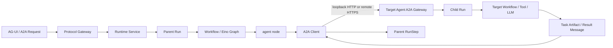

# GoAI A2A Runtime

## 定位

GoAI 是多 Agent 协议运行时平台。Agent 之间的业务通信统一使用 A2A；Workflow/Eino Graph 负责描述某个 Agent 如何执行能力，不能替代 Agent 间协议通信。



## 通信边界

- 本地 Agent：使用 loopback HTTP 访问目标 Agent 的 A2A Gateway。
- 远程 Agent：必须使用 HTTPS；远程 HTTP 地址被出站客户端拒绝。
- Kafka：只负责 Run 执行消息、重试和 Worker 异步边界，不表达 Agent 委派语义。
- 禁止 `RunService -> TargetAgentService` 进程内直调。
- 禁止只投递一个 `run_id` 的 Kafka 消息来冒充 A2A。

本地和远程使用同一套 A2A HTTP+JSON 请求、Task 状态和结果 Artifact 契约，区别只在传输安全边界。

## 出站调用流程

1. `RunService` 执行 Workflow 的 `agent` 节点。
2. Runtime 根据目标 `Agent`、活跃 `AgentCapability` 和活跃 A2A `AgentEndpoint` 组装 `AgentInvocationRequest`。
3. `a2aclient` 通过 Agent Card discovery 获取目标能力声明，并校验 HTTP+JSON binding、Capability 和 Delegation extension。
4. Client 使用官方 A2A Go SDK 发送 `message:send`。
5. 如果目标返回 Task，Client 按稳定 TaskID 轮询 Task，直到 `completed` 或失败终态。
6. Artifact、状态消息或 Agent Message 被收敛为 `AgentInvocationResult`。
7. Runtime 把结果写入当前 `RunStep.OutputJSON`，后续节点可以通过 `input_from` 引用该成功步骤。

## 委派关联元数据

GoAI 在 Delegation 扩展中同时传递协议路由信息和运行时关联信息：

```json
{
  "https://goai.dev/extensions/delegation/v1": {
    "sourceAgentCode": "planner",
    "capabilityCode": "write",
    "parentRunId": "run-parent",
    "traceId": "trace-parent",
    "delegationId": "a2a_delegation_id"
  }
}
```

- `parentRunId` 关联源 Agent 的 Parent Run。
- `delegationId` 是基于 Parent Run 与 Workflow 节点生成的稳定委派标识，重试不会变化。
- `traceId` 贯通出站 A2A 请求、目标 Agent Child Run、Delegation、RunStep 和日志。
- 目标 Gateway 将扩展映射为内部 `AcceptDelegationCommand`，再落库为 `Message + Delegation + Child Run`；外部协议字段不会渗透到执行器。

## Workflow agent 节点

```json
{
  "key": "delegate_writer",
  "type": "agent",
  "config": {
    "target_agent": "writer",
    "capability": "write",
    "input_from": ["planner"],
    "timeout_ms": 120000
  }
}
```

字段语义：

- `target_agent`：目标 Agent 的稳定 `agent_code`。
- `capability`：目标 Agent 暴露的活跃能力编码。
- `input_from`：只读取成功的上游 RunStep 输出，并与原始 Run 输入聚合。
- `timeout_ms`：单次 Agent 委派超时，默认 120 秒，最大 300 秒。

聚合输入形状：

```json
{
  "run_input": {"prompt": "draft"},
  "step_outputs": {
    "planner": {"plan": "..."}
  }
}
```

## 幂等与重试

- `TaskID = hash("task", parent_run_id, node_key)`。
- `MessageID = hash("message", parent_run_id, node_key)`。
- `DelegationID = hash("delegation", parent_run_id, node_key)`。
- 节点失败时由 RunService 使用已有 Step retry 策略重试，但不会因为 retry attempt 改变协议 ID。
- 目标 Task 的非完成终态会传播为当前 Agent 节点失败；不可重试的协议错误不会被重复发送。
- Parent Run replay 会生成新的 Parent RunID，因此会自然生成新的 Child TaskID/MessageID。

## 运行时去重契约

- `POST /api/runs` 和 replay 使用 `Idempotency-Key` 时，由 `owner_user_id + operation + idempotency_key` 唯一绑定请求哈希和 Run；相同请求返回原 Run，不同请求返回冲突。
- Kafka 使用至少一次投递语义；Worker 通过数据库条件更新原子 claim `queued -> running`，只有成功 claim 的 Worker 才能执行 Workflow，重复消息对已 claim 或终态 Run 做 no-op。
- A2A 入站委派使用稳定的 Child Run ID、请求 Message ID 和 Delegation ID；同一个协议重试会复用已有协作记录，不重复创建 Child Run、请求消息或执行事件。
- Delegation 结果消息由 Child Run 的终态收敛生成，并通过唯一 Message ID 和终态条件更新保证重复 reconciliation 不产生第二条结果消息。
- Kafka 发布失败会把已落库的 Run/Delegation 保留为失败状态；调用方必须使用新的幂等键或新的协议 Run ID 发起新的业务尝试。

## 当前限制

- V1 使用 Worker 内阻塞轮询，父 Run 在 A2A Task 完成前不会释放执行线程。
- 当前只支持串行 Workflow 执行，不支持多个 Agent 子任务并行聚合。
- 尚未提供 Agent-to-Agent 身份认证、授权和凭据引用解析，A2A Gateway 只适合受控网络。
- 当前不实现 callback 驱动的 suspend/resume。
- Eino Graph 当前作为单个 Agent 的能力执行器，已接入串行/可达 Workflow 执行；后续并行、条件和流式能力仍必须复用本 A2A 边界。

## 测试契约

协议实现至少需要覆盖：

- loopback HTTP 成功调用和远程 HTTP 拒绝。
- HTTPS endpoint 成功调用。
- Agent Card 缺少能力或 Delegation extension 时拒绝。
- Task ID mismatch、失败终态和 context cancellation。
- `input_from` 聚合、稳定 TaskID/MessageID、节点重试不重复创建子任务。
- 入站 Gateway 与出站 Client 的 HTTP+JSON 契约。